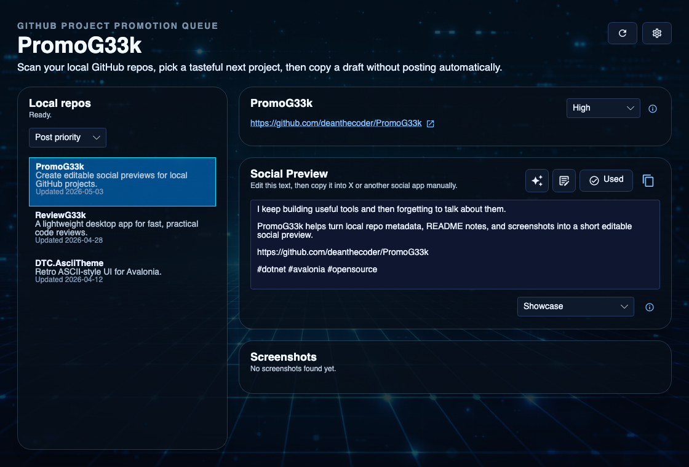

[](https://twitter.com/deanthecoder)

# PromoG33k

PromoG33k helps developers share their own GitHub projects more easily.

If you have a folder full of repos, but you are not naturally in the habit of posting about them, PromoG33k gives you a friendly promotion queue: pick a project, generate a social preview, copy the text and screenshots, then post manually wherever you like.



## Why

Good side projects often stay invisible because writing about them takes a different kind of energy from building them.

PromoG33k is designed to make that last step feel smaller and easier. It looks at projects you already have locally, pulls out useful README context and screenshots, and helps draft a short human-sounding update. It does not post for you, automate social sites, or push you toward spammy behavior. You stay in control.

## What It Does

- Generates editable social preview text with the OpenAI API.
- Shows screenshot candidates as real images.
- Copies screenshot image data to the clipboard.
- Regenerates from the current preview with an optional custom instruction.
- Supports different post angles such as showcase, progress update, technical nugget, problem/solution, and demo/video.
- Lets you mark a social preview as used so the queue can avoid repeating the same project too soon.
- Lets you set repo priority to High, Normal, or Excluded.
- Scans a local folder of GitHub repos.
- Includes only repos where it can find a GitHub project URL.
- Extracts README headings, feature-style bullets, descriptions, and screenshots.

## Local First

PromoG33k is local-first. It works directly from your source folder and does not require GitHub authentication or external services to discover your projects. In Settings, choose the folder that contains your repositories, for example:

```text
~/Documents/Source/Repos
```

Supported remote formats include:

```text
https://github.com/owner/repo.git
git@github.com:owner/repo.git
ssh://git@github.com/owner/repo.git
```

## AI Generation

PromoG33k uses the OpenAI API only when you click **Generate**. The app sends compact project facts rather than blindly dumping whole files into the prompt:

- repo name
- GitHub URL
- language
- README description
- README headings
- README highlight bullets
- number of screenshots and demos
- selected post style

The generated text appears in **Social Preview**, where you can edit it before copying. If the preview is close but not quite right, you can regenerate with a custom instruction such as asking for a shorter, warmer, or more technical version; PromoG33k includes the current preview as context for that request.

### Example Output

```text
Built a small tool called PromoG33k that turns your GitHub repos into ready-to-post social updates.

It pulls screenshots straight from your README and lets you copy everything in seconds.

https://github.com/deanthecoder/PromoG33k

#dotnet #buildinpublic #indiedev
```

## Screenshots

README image references are resolved against the local repository folder, so screenshots already checked into your projects can be reused.

Click a screenshot preview to copy the image data to the clipboard.

## Build and Run

Prereqs:

- .NET 9 SDK

```bash
dotnet build PromoG33k.sln
dotnet run --project PromoG33k.csproj
```

## License

Licensed under the MIT License. See [LICENSE](LICENSE) for details.
